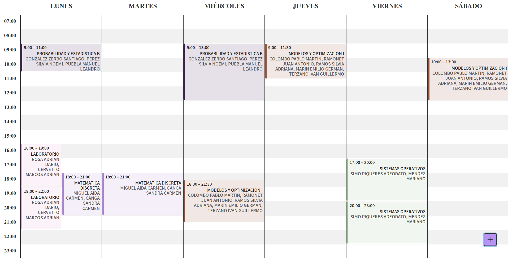

# [FIUBA-Plan](https://fede.dm/FIUBA-Plan/)

Organizador de horarios de la Facultad de Ingenieria

---



Esta aplicación está hecha en React y todo su código fuente está en `src` (y dos archivos sueltos en `public`), y para la interfaz usa [Chakra](https://chakra-ui.com/). El sitio compilado en sí está en el directorio `docs`, y esto es lo que se sirve con github pages.

## Desarrollo

Para agregar un feature o fixear un issue hay que clonar el repositorio, instalar las dependencias con `npm install` y después correr la aplicación con `npm start`. En `localhost:3000/` va a estar corriendo la aplicación constantemente, y toda modificación que se haga al código se va a ver reflejada en la página.

Una vez terminados los cambios, con solo hacer un PR basta (porque la aplicación se compila automáticamente con cada push a master)

## Actualización cuatrimestral de horarios

Todos los cuatrimestres hay que actualizar los horarios de la aplicación (siempre teniendo en cuenta que los primeros horarios publicados suelen cambiar bastante porque se encuentran errores o hay modificaciones en la semana de inscripcion). Este proceso esta automatizado con github actions: todas las noches a las 12 de la noche el script [`get_cursos.ipynb`](get_cursos.ipynb) llama a la API de [https://ofertahoraria.fi.uba.ar](https://ofertahoraria.fi.uba.ar) y vierte los horarios nuevos en `src/data/horarios.js`.

Por otro lado, la lista de materias por carrera se encuentra en `src/data/carreras.js` y esta hecha 'a mano' (porque no sale de ningun lado, más que de registros de cuatris anteriores). Esta lista es algo que no debería cambiar cuatrimestre a cuatrimestre, pero si una materia fuese a cambiar de código entonces habría que actualizar ese archivo.

---

De todas formas, si algún día falla github actions, falla la API de ofertahoraria, el mantenedor se recibe y deja de prestarle atención a FIUBA, o cualquier otro inconveniente sucede, lo único que importa es mantener `src/data/horarios.js` actualizado. No importa cómo se consigan los datos hay que llegar a un json del siguiente formato:

```jsonc
// Este json tiene que estar ordenado por claves, (logrado con el método de python `json.dumps(DATA, indent=2, ensure_ascii=False, sort_keys=True)`), de esta manéra los diffs van a ser mucho más legibles
{
  "cuatrimestre": "2020C2", // Nombre de Cuatrimestre, para la notificación al entrar al sitio ("Actualizado al 2020C2")
  "timestamp": "28/10/2021 12:05:25", // Un timestamp que se usa como identificador del json. Esto sirve para comparar contra la última actualización de horarios.
  "materias": [ // Array de todas las materias de todas las carreras
    {
      "codigo": "7641", // Código de la materia, que es por el cual se la identifica para decidir qué carrera la contiene
      "nombre": "BIOTECNOLOGIA", // Nombre de la materia
      "cursos": [ // Array de códigos de los cursos de la materia. Este número no tiene por que ser fiel al "verdadero" código de las comisiones, con tal de que funcione como identificador (único) de cursos, ya está. Puede ser un número al azar, o algo como "7641-1","7641-2",etc.
        "29811",
        "...",
      ]
    },
    {...}
  ],
  "cursos": [ // Array de todos los cursos de todas las materias de todas las carreras
    {
      "docentes": "XXX YYY, ZZZ", // Lista de docentes. Esto es lo que más le sirve al alumno. (A nadie le sirve decir "Me anote al curso 3", todos quieren decir "Me anote con Acero")
      "codigo": "29811", // Código del curso. Este código es único, y es como se lo identifica al curso, para poder meterlo dentro de cada materia
      "clases": [ // Array de cada clase del curso. Este es el dato que termina plasmado sobre el calendario en forma de 'event'. En un futuro, se puede agregar metadata de cada clase (en qué aula se cursa, en que sede, si es teórica/práctica, etc), pero por ahora optamos por el minimalismo
        {
          "dia": 3, // Día de la clase, siendo el 0 un domingo (o sea, este ejemplo se cursa el día miércoles). Ojo que es un entero!
          "inicio": "18:00", // Hora de inicio de la clase, tiene que ser un string con este formato (HH:MM)
          "fin": "22:00" // Hora de fin de la clase, tiene que ser un string con este formato (HH:MM)
        },
        {
          "dia": 5,
          "inicio": "19:00",
          "fin": "21:00"
        },
        {...}
      ]
    },
    {...}
  ]
}

// En todos los casos, hay que tener el cuidado de que el JSON no repita información.
// Es decir, si tanto Ing en Informática como Lic en Sistemas pueden cursar Algoritmos 1 (con el mismo código), esa materia tiene que aparecer solo una vez en todo el json. Lo mismo sucede con sus respectivos cursos

// Otro cuidado a tener es que hay materias que tienen el mismo nombre pero distinto código. Estas son materias distintas, por más que compartan nombres, y tienen distintos cursos (que tal vez comparten los docentes), con sus respectivos códigos.
```
