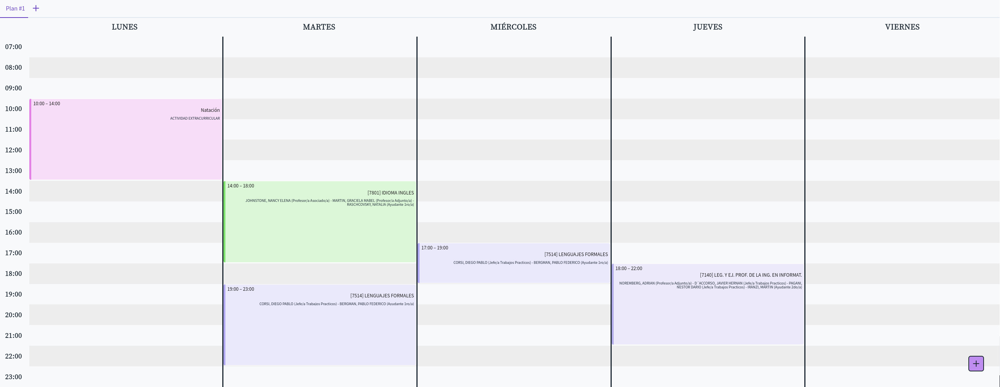

# [FIUBA-Plan](https://fdelmazo.github.io/FIUBA-Plan/)

Organizador de horarios de la Facultad de Ingenieria 

---



## Desarrollo

- Instalar las dependencias

```
npm install
```

- Corre la aplicación, y modifica lo que quieras

```
npm start
```

- Compila el sitio antes de hacer el PR

```
npm run build
```
